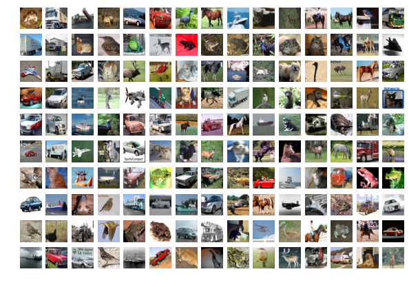
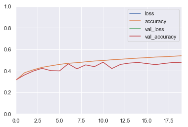
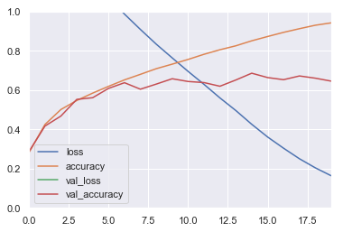
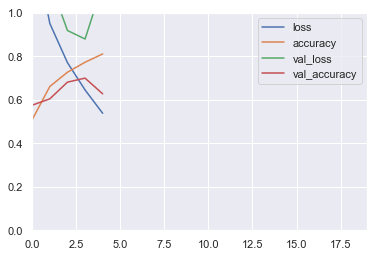

# CNN

In this notebook you will learn how to build Convolutional Neural Networks (CNNs) for image processing.

## Imports


```python
%matplotlib inline
```


```python
import matplotlib as mpl
import matplotlib.pyplot as plt
import numpy as np
import os
import pandas as pd
import sklearn
import sys
import tensorflow as tf
from tensorflow import keras
import time
import seaborn as sns
sns.set()
```


```python
print("python", sys.version)
for module in mpl, np, pd, sklearn, tf, keras:
    print(module.__name__, module.__version__)
```

    python 3.7.1 (default, Dec 14 2018, 13:28:58) 
    [Clang 4.0.1 (tags/RELEASE_401/final)]
    matplotlib 3.0.2
    numpy 1.15.4
    pandas 0.23.4
    sklearn 0.20.1
    tensorflow 2.0.0-beta0
    tensorflow.python.keras.api._v2.keras 2.2.4-tf


```python
assert sys.version_info >= (3, 5) # Python ≥3.5 required
assert tf.__version__ >= "2.0"    # TensorFlow ≥2.0 required
```

### Simple CNN

Load CIFAR10 using `keras.datasets.cifar10.load_data()`, and split it into a training set (45,000 images), a validation set (5,000 images) and a test set (10,000 images). Make sure the pixel values range from 0 to 1. Visualize a few images using `plt.imshow()`.


```python
classes = [
    "airplane",
    "automobile",
    "bird",
    "cat",
    "deer",
    "dog",
    "frog",
    "horse",
    "ship",
    "truck",
]
```


```python
(X_train_full, y_train_full), (X_test, y_test) = keras.datasets.cifar10.load_data()

X_train = X_train_full[:-5000] / 255
y_train = y_train_full[:-5000]

X_valid = X_train_full[-5000:] / 255
y_valid = y_train_full[-5000:]

X_test = X_test / 255
```


```python
plt.figure(figsize=(10, 7))
n_rows, n_cols = 10, 15
for row in range(n_rows):
    for col in range(n_cols):
        i = row * n_cols + col
        plt.subplot(n_rows, n_cols, i + 1)
        plt.axis("off")
        plt.imshow(X_train[i])
```





Let's print the classes of the images in the first row:


```python
for i in range(n_cols):
    print(classes[y_train[i][0]], end=" ")
```

    frog truck truck deer automobile automobile bird horse ship cat deer horse horse bird truck 

### 1.  Baseline Model

Build and train a baseline model with a few dense layers, and plot the learning curves. Use the model's `summary()` method to count the number of parameters in this model.

**Tip**:

* Recall that to plot the learning curves, you can simply create a Pandas `DataFrame` with the `history.history` dict, then call its `plot()` method.


```python
model = keras.models.Sequential([
    
    keras.layers.Flatten(input_shape=[32, 32, 3]),
    
    keras.layers.Dense(64, activation="selu"),
    keras.layers.Dense(64, activation="selu"),
    keras.layers.Dense(64, activation="selu"),
    keras.layers.Dense(10, activation="softmax")
])
```

    WARNING: Logging before flag parsing goes to stderr.
    W1229 09:21:53.523933 4571825600 deprecation.py:323] From /Users/admin/anaconda3/lib/python3.7/site-packages/tensorflow/python/keras/backend.py:4149: add_dispatch_support.<locals>.wrapper (from tensorflow.python.ops.array_ops) is deprecated and will be removed in a future version.
    Instructions for updating:
    Use tf.where in 2.0, which has the same broadcast rule as np.where


```python
model.compile(loss="sparse_categorical_crossentropy",
              optimizer=keras.optimizers.SGD(lr=0.01),
              metrics=["accuracy"])
```


```python
model.summary()
```

    Model: "sequential_2"
    _________________________________________________________________
    Layer (type)                 Output Shape              Param #   
    =================================================================
    flatten_2 (Flatten)          (None, 3072)              0         
    _________________________________________________________________
    dense_8 (Dense)              (None, 64)                196672    
    _________________________________________________________________
    dense_9 (Dense)              (None, 64)                4160      
    _________________________________________________________________
    dense_10 (Dense)             (None, 64)                4160      
    _________________________________________________________________
    dense_11 (Dense)             (None, 10)                650       
    =================================================================
    Total params: 205,642
    Trainable params: 205,642
    Non-trainable params: 0
    _________________________________________________________________


```python
history = model.fit(X_train, y_train, epochs=5,
                    validation_data=(X_valid, y_valid))
```

    Train on 45000 samples, validate on 5000 samples
    Epoch 1/5
    45000/45000 [==============================] - 4s 82us/sample - loss: 1.8995 - accuracy: 0.3133 - val_loss: 1.8570 - val_accuracy: 0.3368
    Epoch 2/5
    45000/45000 [==============================] - 3s 77us/sample - loss: 1.7134 - accuracy: 0.3834 - val_loss: 1.7347 - val_accuracy: 0.3782
    Epoch 3/5
    45000/45000 [==============================] - 4s 79us/sample - loss: 1.6369 - accuracy: 0.4152 - val_loss: 1.6705 - val_accuracy: 0.4022
    Epoch 4/5
    45000/45000 [==============================] - 4s 79us/sample - loss: 1.5826 - accuracy: 0.4356 - val_loss: 1.6407 - val_accuracy: 0.4118
    Epoch 5/5
    45000/45000 [==============================] - 3s 77us/sample - loss: 1.5412 - accuracy: 0.4512 - val_loss: 1.5708 - val_accuracy: 0.4322


```python
pd.DataFrame(history.history).plot()
plt.axis([0, 19, 0, 1])
plt.show()
```





--------

### 2. Convolution 2D, Pool2D
Build and train a Convolutional Neural Network using a "classical" architecture: N * (Conv2D → Conv2D → Pool2D) → Flatten → Dense → Dense. Before you print the `summary()`, try to manually calculate the number of parameters in your model's architecture, as well as the shape of the inputs and outputs of each layer. Next, plot the learning curves and compare the performance with the previous model.

Demo: https://cs231n.github.io/convolutional-networks/


```python
model = keras.models.Sequential([
    
    keras.layers.Conv2D(filters=32,\
                        kernel_size=3,\
                        padding="same",\
                        activation="relu",\
                        input_shape=[32, 32, 3]),
    
    keras.layers.Conv2D(filters=32,\
                        kernel_size=3,\
                        padding="same",\
                        activation="relu"),
    
    keras.layers.MaxPool2D(pool_size=2),
    
    keras.layers.Conv2D(filters=64,\
                        kernel_size=3,\
                        padding="same",\
                        activation="relu"),
    
    keras.layers.Conv2D(filters=64,\
                        kernel_size=3,\
                        padding="same",\
                        activation="relu"),
    
    keras.layers.MaxPool2D(pool_size=2),
    
    keras.layers.Flatten(),
    
    keras.layers.Dense(128,\
                       activation="relu"),
    
    keras.layers.Dense(10,\
                       activation="softmax")
])
```


```python
model.summary()
```

    Model: "sequential_3"
    _________________________________________________________________
    Layer (type)                 Output Shape              Param #   
    =================================================================
    conv2d (Conv2D)              (None, 32, 32, 32)        896       
    _________________________________________________________________
    conv2d_1 (Conv2D)            (None, 32, 32, 32)        9248      
    _________________________________________________________________
    max_pooling2d (MaxPooling2D) (None, 16, 16, 32)        0         
    _________________________________________________________________
    conv2d_2 (Conv2D)            (None, 16, 16, 64)        18496     
    _________________________________________________________________
    conv2d_3 (Conv2D)            (None, 16, 16, 64)        36928     
    _________________________________________________________________
    max_pooling2d_1 (MaxPooling2 (None, 8, 8, 64)          0         
    _________________________________________________________________
    flatten_3 (Flatten)          (None, 4096)              0         
    _________________________________________________________________
    dense_12 (Dense)             (None, 128)               524416    
    _________________________________________________________________
    dense_13 (Dense)             (None, 10)                1290      
    =================================================================
    Total params: 591,274
    Trainable params: 591,274
    Non-trainable params: 0
    _________________________________________________________________


```python
# Number of params in a convolutional layer =
# (kernel_width * kernel_height * channels_in + 1 for bias) * channels_out
(
    (3 * 3 * 3 + 1)  * 32  # in: 32x32x3   out: 32x32x32  Conv2D
  + (3 * 3 * 32 + 1) * 32  # in: 32x32x32  out: 32x32x32  Conv2D
  + 0                      # in: 32x32x32  out: 16x16x32  MaxPool2D
  + (3 * 3 * 32 + 1) * 64  # in: 16x16x32  out: 16x16x64  Conv2D
  + (3 * 3 * 64 + 1) * 64  # in: 16x16x64  out: 16x16x64  Conv2D
  + 0                      # in: 16x16x64  out: 8x8x64    MaxPool2D
  + 0                      # in: 8x8x64    out: 4096      Flatten
  + (4096 + 1) * 128       # in: 4096      out: 128       Dense
  + (128 + 1) * 10         # in: 128       out: 10        Dense
)
```


    591274


```python
model.compile(loss="sparse_categorical_crossentropy",
              optimizer=keras.optimizers.SGD(lr=0.01),
              metrics=["accuracy"])
```


```python
pd.DataFrame(history.history).plot()
plt.axis([0, 19, 0, 1])
plt.show()
```





----------

### Bathch Normalization
Looking at the learning curves, you can see that the model is overfitting. Add a Batch Normalization layer after each convolutional layer. Compare the model's performance and learning curves with the previous model.

**Tip**: there is no need for an activation function just before the pooling layers.


```python
model = keras.models.Sequential([
    
    keras.layers.Conv2D(filters=32,
                        kernel_size=3,
                        padding="same",
                        activation="relu",
                        input_shape=[32, 32, 3]),
    
    keras.layers.BatchNormalization(),
    
    keras.layers.Conv2D(filters=32,
                        kernel_size=3,
                        padding="same",
                        activation="relu"),
    
    keras.layers.BatchNormalization(),
    
    keras.layers.MaxPool2D(pool_size=2),
    
    keras.layers.Conv2D(filters=64,
                        kernel_size=3,
                        padding="same",
                        activation="relu"),
    
    keras.layers.BatchNormalization(),
    
    keras.layers.Conv2D(filters=64,
                        kernel_size=3,
                        padding="same",
                        activation="relu"),
    
    keras.layers.BatchNormalization(),
    
    keras.layers.MaxPool2D(pool_size=2),
    
    keras.layers.Flatten(),
    
    keras.layers.Dense(128,
                       activation="relu"),
    
    keras.layers.Dense(10,
                       activation="softmax")
])
```


```python
model.summary()
```

    Model: "sequential_1"
    _________________________________________________________________
    Layer (type)                 Output Shape              Param #   
    =================================================================
    conv2d (Conv2D)              (None, 32, 32, 32)        896       
    _________________________________________________________________
    batch_normalization (BatchNo (None, 32, 32, 32)        128       
    _________________________________________________________________
    conv2d_1 (Conv2D)            (None, 32, 32, 32)        9248      
    _________________________________________________________________
    batch_normalization_1 (Batch (None, 32, 32, 32)        128       
    _________________________________________________________________
    max_pooling2d (MaxPooling2D) (None, 16, 16, 32)        0         
    _________________________________________________________________
    conv2d_2 (Conv2D)            (None, 16, 16, 64)        18496     
    _________________________________________________________________
    batch_normalization_2 (Batch (None, 16, 16, 64)        256       
    _________________________________________________________________
    conv2d_3 (Conv2D)            (None, 16, 16, 64)        36928     
    _________________________________________________________________
    batch_normalization_3 (Batch (None, 16, 16, 64)        256       
    _________________________________________________________________
    max_pooling2d_1 (MaxPooling2 (None, 8, 8, 64)          0         
    _________________________________________________________________
    flatten_1 (Flatten)          (None, 4096)              0         
    _________________________________________________________________
    dense_4 (Dense)              (None, 128)               524416    
    _________________________________________________________________
    dense_5 (Dense)              (None, 10)                1290      
    =================================================================
    Total params: 592,042
    Trainable params: 591,658
    Non-trainable params: 384
    _________________________________________________________________


```python
model.compile(loss="sparse_categorical_crossentropy",
              optimizer=keras.optimizers.SGD(lr=0.01),
              metrics=["accuracy"])
```


```python
history = model.fit(X_train, y_train, epochs=5,
                    validation_data=(X_valid, y_valid))
```

    Train on 45000 samples, validate on 5000 samples
    Epoch 1/5
    45000/45000 [==============================] - 201s 4ms/sample - loss: 1.3647 - accuracy: 0.5088 - val_loss: 1.1809 - val_accuracy: 0.5754
    Epoch 2/5
    45000/45000 [==============================] - 194s 4ms/sample - loss: 0.9513 - accuracy: 0.6615 - val_loss: 1.1434 - val_accuracy: 0.6046
    Epoch 3/5
    45000/45000 [==============================] - 205s 5ms/sample - loss: 0.7711 - accuracy: 0.7269 - val_loss: 0.9189 - val_accuracy: 0.6814
    Epoch 4/5
    45000/45000 [==============================] - 203s 5ms/sample - loss: 0.6454 - accuracy: 0.7729 - val_loss: 0.8797 - val_accuracy: 0.6998
    Epoch 5/5
    45000/45000 [==============================] - 196s 4ms/sample - loss: 0.5381 - accuracy: 0.8112 - val_loss: 1.1316 - val_accuracy: 0.6276


```python
pd.DataFrame(history.history).plot()
plt.axis([0, 19, 0, 1])
plt.show()
```





Try to estimate the number of parameters in your network, then check your result with `model.summary()`.

**Tip**: the batch normalization layer adds two parameters for each feature map (the scale and bias).

## Object Detection Project

The Google [Street View House Numbers](http://ufldl.stanford.edu/housenumbers/) (SVHN) dataset contains pictures of digits in all shapes and colors, taken by the Google Street View cars. The goal is to classify and locate all the digits in large images.
* Train a Fully Convolutional Network on the 32x32 images.
* Use this FCN to build a digit detector in the large images.
