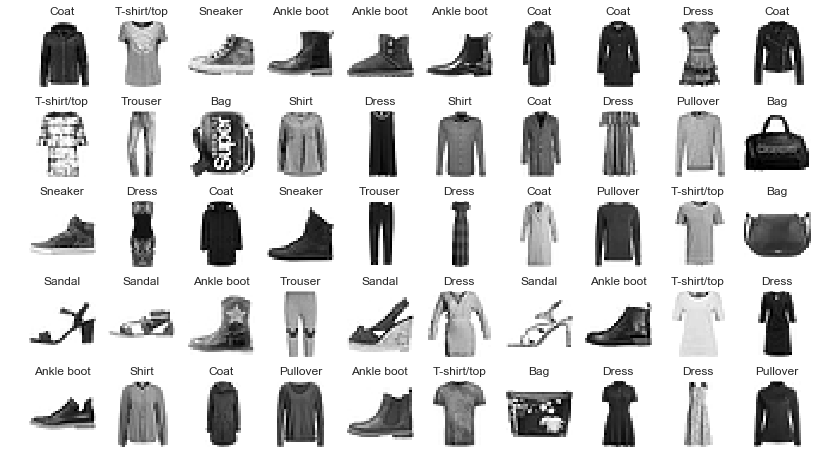
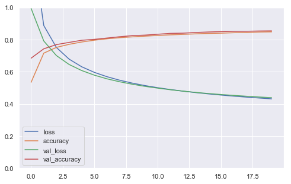

# Neural Net : Feature Scaling

For classifying MNIST digits. 

#### Load dependencies


```python
#pip install tensorflow==2.0.0-beta0
#pip install --upgrade tensorflow==2.0.0-beta0
```


```python
import tensorflow as tf
from tensorflow import keras  # tf.keras
import seaborn as sns
import matplotlib as mpl
import matplotlib.pyplot as plt
import numpy as np
import os
import pandas as pd
import sklearn
import sys
import time
```


```python
sns.set()
%matplotlib inline
%load_ext tensorboard
```

    The tensorboard extension is already loaded. To reload it, use:
      %reload_ext tensorboard


```python
print("python", sys.version)
for module in mpl, np, pd, sklearn, tf, keras:
    print(module.__name__, module.__version__)
```

    python 3.7.1 (default, Dec 14 2018, 13:28:58) 
    [Clang 4.0.1 (tags/RELEASE_401/final)]
    matplotlib 3.0.2
    numpy 1.15.4
    pandas 0.23.4
    sklearn 0.20.1
    tensorflow 2.0.0-beta0
    tensorflow.python.keras.api._v2.keras 2.2.4-tf


#### Load data


```python
fashion_mnist = keras.datasets.fashion_mnist
(X_train_full, y_train_full), (X_test, y_test) = (
    fashion_mnist.load_data())
X_valid, X_train = X_train_full[:5000], X_train_full[5000:]
y_valid, y_train = y_train_full[:5000], y_train_full[5000:]
```


```python
X_train.shape, y_train.shape
```


    ((55000, 28, 28), (55000,))


```python
class_names = ["T-shirt/top", "Trouser", "Pullover", "Dress", "Coat",
               "Sandal", "Shirt", "Sneaker", "Bag", "Ankle boot"]
```


```python
#X_train[0]
```


```python
n_rows = 5
n_cols = 10
plt.figure(figsize=(n_cols*1.4, n_rows * 1.6))
for row in range(n_rows):
    for col in range(n_cols):
        index = n_cols * row + col
        plt.subplot(n_rows, n_cols, index + 1)
        plt.imshow(X_train[index], cmap="binary", interpolation="nearest")
        plt.axis('off')
        plt.title(class_names[y_train[index]])
plt.show()
```





```python
y_train[0:50]
```


    array([4, 0, 7, 9, 9, 9, 4, 4, 3, 4, 0, 1, 8, 6, 3, 6, 4, 3, 2, 8, 7, 3,
           4, 7, 1, 3, 4, 2, 0, 8, 5, 5, 9, 1, 5, 3, 5, 9, 0, 3, 9, 6, 4, 2,
           9, 0, 8, 3, 3, 2], dtype=uint8)


```python
class_names[y_train[0]]
```


    'Coat'


### Preprocess data : Feature Scaling

When using Gradient Descent, it is usually best to ensure that the features all have a similar scale, preferably with a Normal distribution. Try to standardize the pixel values and see if this improves the performance of your neural network.

**Tips**:
* For each feature (pixel intensity), you must subtract the `mean()` of that feature (across all instances, so use `axis=0`) and divide by its standard deviation (`std()`, again `axis=0`). Alternatively, you can use Scikit-Learn's `StandardScaler`.
* Make sure you compute the means and standard deviations on the training set, and use these statistics to scale the training set, the validation set and the test set (you should not fit the validation set or the test set, and computing the means and standard deviations counts as "fitting").


```python
pixel_means = X_train.mean(axis = 0)
pixel_stds = X_train.std(axis = 0)

X_train_scaled = (X_train - pixel_means) / pixel_stds
X_valid_scaled = (X_valid - pixel_means) / pixel_stds
```


```python
from sklearn.preprocessing import StandardScaler

scaler = StandardScaler()
X_train_scaled = scaler.fit_transform(X_train.astype(np.float32)\
                                      .reshape(-1, 28 * 28)).reshape(-1, 28, 28)
X_valid_scaled = scaler.transform(X_valid.astype(np.float32)\
                                  .reshape(-1, 28 * 28)).reshape(-1, 28, 28)
X_test_scaled = scaler.transform(X_test.astype(np.float32)\
                                 .reshape(-1, 28 * 28)).reshape(-1, 28, 28)
```

#### Design neural network architecture

```

model
   = keras.models.sequential([
       keras.layer.layerType(parameters...),
       keras.layer.layerType(parameters...),
       keras.layer.layerType(parameters...),
       keras.layer.layerType(parameters...)
   ])
   
```


```python
model = keras.models.Sequential([
    keras.layers.Flatten(input_shape=[28, 28]),
    keras.layers.Dense(300, activation="relu"),
    keras.layers.Dense(100, activation="relu"),
    keras.layers.Dense(10, activation="softmax")
])
```


```python
model.summary()
```

    Model: "sequential_5"
    _________________________________________________________________
    Layer (type)                 Output Shape              Param #   
    =================================================================
    flatten_3 (Flatten)          (None, 784)               0         
    _________________________________________________________________
    dense_17 (Dense)             (None, 300)               235500    
    _________________________________________________________________
    dense_18 (Dense)             (None, 100)               30100     
    _________________________________________________________________
    dense_19 (Dense)             (None, 10)                1010      
    =================================================================
    Total params: 266,610
    Trainable params: 266,610
    Non-trainable params: 0
    _________________________________________________________________


#### Configure model


```python
model.compile(loss="sparse_categorical_crossentropy",
              optimizer=keras.optimizers.SGD(1e-3),\
              metrics=["accuracy"])
```

#### Train!


```python
history = model.fit(X_train_scaled,\
                    y_train,\
                    batch_size=128,\
                    epochs=20,
                    validation_data=(X_valid_scaled, y_valid))
```

    Train on 55000 samples, validate on 5000 samples
    Epoch 1/20
    55000/55000 [==============================] - 2s 32us/sample - loss: 1.4371 - accuracy: 0.5344 - val_loss: 0.9933 - val_accuracy: 0.6844
    Epoch 2/20
    55000/55000 [==============================] - 2s 29us/sample - loss: 0.8873 - accuracy: 0.7155 - val_loss: 0.7911 - val_accuracy: 0.7424
    Epoch 3/20
    55000/55000 [==============================] - 2s 29us/sample - loss: 0.7508 - accuracy: 0.7513 - val_loss: 0.7003 - val_accuracy: 0.7688
    Epoch 4/20
    55000/55000 [==============================] - 1s 27us/sample - loss: 0.6783 - accuracy: 0.7703 - val_loss: 0.6451 - val_accuracy: 0.7822
    Epoch 5/20
    55000/55000 [==============================] - 1s 27us/sample - loss: 0.6306 - accuracy: 0.7848 - val_loss: 0.6072 - val_accuracy: 0.7956
    Epoch 6/20
    55000/55000 [==============================] - 2s 27us/sample - loss: 0.5958 - accuracy: 0.7960 - val_loss: 0.5785 - val_accuracy: 0.8012
    Epoch 7/20
    55000/55000 [==============================] - 2s 28us/sample - loss: 0.5689 - accuracy: 0.8047 - val_loss: 0.5556 - val_accuracy: 0.8094
    Epoch 8/20
    55000/55000 [==============================] - 2s 28us/sample - loss: 0.5471 - accuracy: 0.8118 - val_loss: 0.5374 - val_accuracy: 0.8176
    Epoch 9/20
    55000/55000 [==============================] - 2s 28us/sample - loss: 0.5290 - accuracy: 0.8168 - val_loss: 0.5221 - val_accuracy: 0.8244
    Epoch 10/20
    55000/55000 [==============================] - 2s 29us/sample - loss: 0.5138 - accuracy: 0.8212 - val_loss: 0.5089 - val_accuracy: 0.8276
    Epoch 11/20
    55000/55000 [==============================] - 2s 32us/sample - loss: 0.5007 - accuracy: 0.8255 - val_loss: 0.4979 - val_accuracy: 0.8330
    Epoch 12/20
    55000/55000 [==============================] - 2s 30us/sample - loss: 0.4892 - accuracy: 0.8293 - val_loss: 0.4879 - val_accuracy: 0.8384
    Epoch 13/20
    55000/55000 [==============================] - 2s 30us/sample - loss: 0.4792 - accuracy: 0.8322 - val_loss: 0.4793 - val_accuracy: 0.8398
    Epoch 14/20
    55000/55000 [==============================] - 2s 30us/sample - loss: 0.4702 - accuracy: 0.8355 - val_loss: 0.4713 - val_accuracy: 0.8438
    Epoch 15/20
    55000/55000 [==============================] - 2s 29us/sample - loss: 0.4622 - accuracy: 0.8381 - val_loss: 0.4644 - val_accuracy: 0.8470
    Epoch 16/20
    55000/55000 [==============================] - 2s 29us/sample - loss: 0.4549 - accuracy: 0.8397 - val_loss: 0.4583 - val_accuracy: 0.8494
    Epoch 17/20
    55000/55000 [==============================] - 2s 30us/sample - loss: 0.4482 - accuracy: 0.8425 - val_loss: 0.4527 - val_accuracy: 0.8512
    Epoch 18/20
    55000/55000 [==============================] - 2s 29us/sample - loss: 0.4421 - accuracy: 0.8443 - val_loss: 0.4476 - val_accuracy: 0.8516
    Epoch 19/20
    55000/55000 [==============================] - 2s 29us/sample - loss: 0.4365 - accuracy: 0.8468 - val_loss: 0.4428 - val_accuracy: 0.8532
    Epoch 20/20
    55000/55000 [==============================] - 2s 28us/sample - loss: 0.4313 - accuracy: 0.8479 - val_loss: 0.4386 - val_accuracy: 0.8540


```python
model.evaluate(X_test_scaled, y_test)
```

    10000/10000 [==============================] - 0s 39us/sample - loss: 0.4680 - accuracy: 0.8349


    [0.4679875907897949, 0.8349]


```python
def plot_learning_curves(history):
    pd.DataFrame(history.history).plot(figsize=(8, 5))
    plt.grid(True)
    plt.gca().set_ylim(0, 1)
    plt.show()
```


```python
plot_learning_curves(history)
```





#### Performing Inference


```python
model.evaluate(X_test, y_test)
```

    10000/10000 [==============================] - 0s 33us/sample - loss: 6.5878 - accuracy: 0.5762


    [6.58776294708252, 0.5762]


```python
X_valid.shape
```


    (5000, 28, 28)


```python
n_new = 10
X_new = X_test[:n_new]
y_proba = model.predict(X_new)
y_proba.round(2)
```


    array([[0., 0., 0., 0., 0., 0., 0., 0., 0., 1.],
           [0., 0., 1., 0., 0., 0., 0., 0., 0., 0.],
           [0., 1., 0., 0., 0., 0., 0., 0., 0., 0.],
           [0., 1., 0., 0., 0., 0., 0., 0., 0., 0.],
           [0., 0., 1., 0., 0., 0., 0., 0., 0., 0.],
           [0., 0., 0., 0., 1., 0., 0., 0., 0., 0.],
           [0., 0., 0., 0., 1., 0., 0., 0., 0., 0.],
           [0., 0., 0., 0., 1., 0., 0., 0., 0., 0.],
           [0., 0., 0., 0., 0., 0., 0., 0., 1., 0.],
           [0., 0., 0., 0., 0., 0., 0., 0., 1., 0.]], dtype=float32)


```python
y_pred = model.predict_classes(X_new)
y_pred
```


    array([9, 2, 1, 1, 2, 4, 4, 4, 8, 8])


```python
for item in y_pred:
    print(class_names[item])
```

    Ankle boot
    Pullover
    Trouser
    Trouser
    Pullover
    Coat
    Coat
    Coat
    Bag
    Bag


```python
plt.imshow(valid_0.reshape(28,28))
```


    <matplotlib.image.AxesImage at 0x1a38b67550>


```python

```
