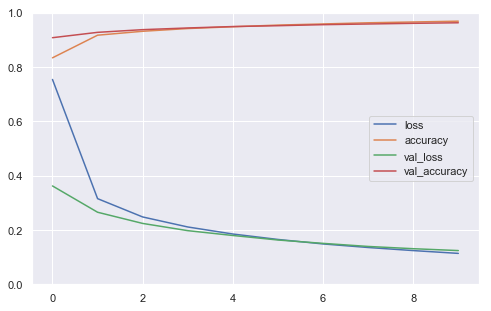
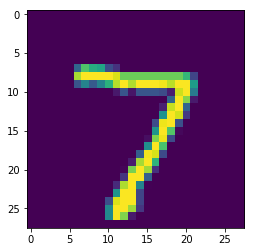

# Neural Net : Introduction

For classifying MNIST digits. 

#### Intall Tensorflow


```python
#pip install tensorflow==2.0.0-beta0
#pip install --upgrade tensorflow==2.0.0-beta0
```


```python
import tensorflow as tf
from tensorflow import keras  # tf.keras
import seaborn as sns
import matplotlib as mpl
import matplotlib.pyplot as plt
import numpy as np
import os
import pandas as pd
import sklearn
import sys
import time
```


```python
sns.set()
%matplotlib inline
%load_ext tensorboard
```

    The tensorboard extension is already loaded. To reload it, use:
      %reload_ext tensorboard


```python
print("python", sys.version)
for module in mpl, np, pd, sklearn, tf, keras:
    print(module.__name__, module.__version__)
```

    python 3.7.1 (default, Dec 14 2018, 13:28:58) 
    [Clang 4.0.1 (tags/RELEASE_401/final)]
    matplotlib 3.0.2
    numpy 1.15.4
    pandas 0.23.4
    sklearn 0.20.1
    tensorflow 2.0.0-beta0
    tensorflow.python.keras.api._v2.keras 2.2.4-tf


#### Load data


```python
(X_train, y_train), (X_valid, y_valid) = keras.datasets.mnist.load_data()
```

##### What are the shape of the data?


```python
print(X_train.shape, y_train.shape,X_valid.shape, y_valid.shape)
```

    (60000, 28, 28) (60000,) (10000, 28, 28) (10000,)


- There are 60,000 Train data which are 28 by 28 pixcel images and 
- There are 10,000 Train data which are also 28 by 28 pixcel images

#### Data Visualization


```python
import matplotlib.pyplot as plt
%matplotlib inline

plt.figure(figsize = [10,8])
for i in range(1,51):
    plt.subplot(5,10,i)
    plt.imshow(X_train[i].reshape(28,28))
plt.show()
```


```python
y_train[1:26]
```


    array([0, 4, 1, 9, 2, 1, 3, 1, 4, 3, 5, 3, 6, 1, 7, 2, 8, 6, 9, 4, 0, 9,
           1, 1, 2], dtype=uint8)


#### Preprocess data

We flaten the data (from 28 by 28 to 784) before it is feed into the model. We can also create a layer as a front layer to perform this flattening step.


```python
X_train = X_train.reshape(60000, 784).astype('float32')
X_valid = X_valid.reshape(10000, 784).astype('float32')
```

#### Data Normalization
This step converts the pixcel value ranging from 0 to 255 into 0 to 1.


```python
X_train /= 255
X_valid /= 255
```

#### Prepare Labels
We convert label 1,2,3,4,5,6,7,8,9 in label vectors


```python
n_classes = 10
y_train = keras.utils.to_categorical(y_train, n_classes)
y_valid = keras.utils.to_categorical(y_valid, n_classes)
```


```python
y_train[1:16]
```


    array([[1., 0., 0., 0., 0., 0., 0., 0., 0., 0.],
           [0., 0., 0., 0., 1., 0., 0., 0., 0., 0.],
           [0., 1., 0., 0., 0., 0., 0., 0., 0., 0.],
           [0., 0., 0., 0., 0., 0., 0., 0., 0., 1.],
           [0., 0., 1., 0., 0., 0., 0., 0., 0., 0.],
           [0., 1., 0., 0., 0., 0., 0., 0., 0., 0.],
           [0., 0., 0., 1., 0., 0., 0., 0., 0., 0.],
           [0., 1., 0., 0., 0., 0., 0., 0., 0., 0.],
           [0., 0., 0., 0., 1., 0., 0., 0., 0., 0.],
           [0., 0., 0., 1., 0., 0., 0., 0., 0., 0.],
           [0., 0., 0., 0., 0., 1., 0., 0., 0., 0.],
           [0., 0., 0., 1., 0., 0., 0., 0., 0., 0.],
           [0., 0., 0., 0., 0., 0., 1., 0., 0., 0.],
           [0., 1., 0., 0., 0., 0., 0., 0., 0., 0.],
           [0., 0., 0., 0., 0., 0., 0., 1., 0., 0.]], dtype=float32)


#### Design neural network architecture


Demo: https://datafiction.github.io/docs/ml/perceptron/dlnd-your-first-neural-network/

After the pixels are flattened, the network consists of a sequence of two ```tf.keras.layers.Dense``` layers. These are densely connected, or fully connected, neural layers. The first Dense layer has 64 nodes (or neurons). The second (and last) layer is a 10-node softmax layer that returns an array of 10 probability scores that sum to 1. Each node contains a score that indicates the probability that the current image belongs to one of the 10 classes.

```
model
   = keras.models.sequential([
       keras.layer.layerType(parameters...),
       keras.layer.layerType(parameters...),
       keras.layer.layerType(parameters...),
       keras.layer.layerType(parameters...)
   ])  
```


```python
model = keras.models.Sequential([
    
    
    keras.layers.Dense(64,\
                       activation='sigmoid',\
                       input_shape=(784,)),
    
    keras.layers.Dense(10,\
                       activation='softmax')
    
])
```


```python
model.summary()
```

    Model: "sequential_1"
    _________________________________________________________________
    Layer (type)                 Output Shape              Param #   
    =================================================================
    dense_2 (Dense)              (None, 64)                50240     
    _________________________________________________________________
    dense_3 (Dense)              (None, 10)                650       
    =================================================================
    Total params: 50,890
    Trainable params: 50,890
    Non-trainable params: 0
    _________________________________________________________________


```python
(784*64)+ 64, (64*10)+10
```


    (50240, 650)


#### Configure model

Before the model is ready for training, it needs a few more settings. These are added during the model's compile step:

- ```Loss function``` —This measures how accurate the model is during training. You want to minimize this function to "steer" the model in the right direction.
- ```Optimizer``` —This is how the model is updated based on the data it sees and its loss function.
- ```Metrics``` —Used to monitor the training and testing steps. The following example uses accuracy, the fraction of the images that are correctly classified.


```python
model.compile(loss='categorical_crossentropy',\
              optimizer='adam',\
              metrics=['accuracy'])
```

#### Train!

Now your model is ready to be trained. Call its `fit()` method, passing it the input features (`X_train`) and the target classes (`y_train`). Set `epochs=10` (or else it will just run for a single epoch). You can also (optionally) pass the validation data by setting `validation_data=(X_valid, y_valid)`. If you do, Keras will compute the loss and the additional metrics (the accuracy in this case) on the validation set at the end of each epoch. If the performance on the training set is much better than on the validation set, your model is probably overfitting the training set (or there is a bug, such as a mismatch between the training set and the validation set).
**Note**: the `fit()` method will return a `History` object containing training stats. Make sure to preserve it (`history = model.fit(...)`).


```python
history = model.fit(X_train, y_train,\
          batch_size=128,\
          epochs=10,\
          verbose=1,\
          validation_data=(X_valid, y_valid))
```

    Train on 60000 samples, validate on 10000 samples
    Epoch 1/10
    60000/60000 [==============================] - 1s 15us/sample - loss: 0.1051 - accuracy: 0.9707 - val_loss: 0.1200 - val_accuracy: 0.9641
    Epoch 2/10
    60000/60000 [==============================] - 1s 15us/sample - loss: 0.0973 - accuracy: 0.9732 - val_loss: 0.1133 - val_accuracy: 0.9649
    Epoch 3/10
    60000/60000 [==============================] - 1s 15us/sample - loss: 0.0904 - accuracy: 0.9752 - val_loss: 0.1092 - val_accuracy: 0.9672
    Epoch 4/10
    60000/60000 [==============================] - 1s 15us/sample - loss: 0.0843 - accuracy: 0.9773 - val_loss: 0.1047 - val_accuracy: 0.9689
    Epoch 5/10
    60000/60000 [==============================] - 1s 15us/sample - loss: 0.0786 - accuracy: 0.9789 - val_loss: 0.1019 - val_accuracy: 0.9680
    Epoch 6/10
    60000/60000 [==============================] - 1s 15us/sample - loss: 0.0737 - accuracy: 0.9800 - val_loss: 0.0997 - val_accuracy: 0.9697
    Epoch 7/10
    60000/60000 [==============================] - 1s 16us/sample - loss: 0.0689 - accuracy: 0.9821 - val_loss: 0.0976 - val_accuracy: 0.9702
    Epoch 8/10
    60000/60000 [==============================] - 1s 14us/sample - loss: 0.0648 - accuracy: 0.9831 - val_loss: 0.0957 - val_accuracy: 0.9706
    Epoch 9/10
    60000/60000 [==============================] - 1s 14us/sample - loss: 0.0609 - accuracy: 0.9845 - val_loss: 0.0930 - val_accuracy: 0.9713
    Epoch 10/10
    60000/60000 [==============================] - 1s 14us/sample - loss: 0.0574 - accuracy: 0.9849 - val_loss: 0.0922 - val_accuracy: 0.9723


##### Plot History

Try running `pd.DataFrame(history.history).plot()` to plot the learning curves. To make the graph more readable, you can also set `figsize=(8, 5)`, call `plt.grid(True)` and `plt.gca().set_ylim(0, 1)`.


```python
def plot_learning_curves(history):
    pd.DataFrame(history.history).plot(figsize=(8, 5))
    plt.grid(True)
    plt.gca().set_ylim(0, 1)
    plt.show()
```


```python
plot_learning_curves(history)
```





#### Performing Inference

Call the model's `evaluate()` method, passing it the test set (`X_test` and `y_test`). This will compute the loss (cross-entropy) on the test set, as well as all the additional metrics (in this case, the accuracy). Your model should achieve over 80% accuracy on the test set.


```python
model.evaluate(X_train, y_train)
```

    60000/60000 [==============================] - 1s 18us/sample - loss: 0.0519 - accuracy: 0.9872


    [0.051851865920548634, 0.98723334]


```python
valid_0 = X_valid[0].reshape(1, 784)
```


```python
model.predict(valid_0)
```


    array([[2.8813774e-09, 3.8345047e-10, 1.1818415e-04, 2.0551306e-06,
            2.2122413e-11, 1.7986340e-09, 1.0651025e-13, 9.9987960e-01,
            1.7287803e-08, 1.0190855e-07]], dtype=float32)


```python
model.predict_classes(valid_0)
```


    array([7])


```python
plt.imshow(valid_0.reshape(28,28))
```


    <matplotlib.image.AxesImage at 0x1a478e6278>





Define `X_new` as the first 10 instances of the test set. Call the model's `predict()` method to estimate the probability of each class for each instance (for better readability, you may use the output array's `round()` method):


```python
n_new = 10
X_new = X_train[:n_new]
y_proba = model.predict(X_new)
y_proba.round(2)
```


    array([[0.  , 0.  , 0.  , 0.01, 0.  , 0.99, 0.  , 0.  , 0.  , 0.  ],
           [1.  , 0.  , 0.  , 0.  , 0.  , 0.  , 0.  , 0.  , 0.  , 0.  ],
           [0.  , 0.  , 0.01, 0.  , 0.99, 0.  , 0.  , 0.  , 0.  , 0.  ],
           [0.  , 1.  , 0.  , 0.  , 0.  , 0.  , 0.  , 0.  , 0.  , 0.  ],
           [0.  , 0.  , 0.  , 0.  , 0.  , 0.  , 0.  , 0.  , 0.  , 0.99],
           [0.  , 0.  , 1.  , 0.  , 0.  , 0.  , 0.  , 0.  , 0.  , 0.  ],
           [0.  , 1.  , 0.  , 0.  , 0.  , 0.  , 0.  , 0.  , 0.  , 0.  ],
           [0.  , 0.  , 0.  , 1.  , 0.  , 0.  , 0.  , 0.  , 0.  , 0.  ],
           [0.  , 1.  , 0.  , 0.  , 0.  , 0.  , 0.  , 0.  , 0.  , 0.  ],
           [0.  , 0.  , 0.  , 0.  , 1.  , 0.  , 0.  , 0.  , 0.  , 0.  ]],
          dtype=float32)


Often, you may only be interested in the most likely class. Use `np.argmax()` to get the class ID of the most likely class for each instance. **Tip**: you want to set `axis=1`.


```python
y_pred = y_proba.argmax(axis=1)
y_pred
```


    array([5, 0, 4, 1, 9, 2, 1, 3, 1, 4])


Call the model's `predict_classes()` method for `X_new`. You should get the same result as above.


```python
y_pred = model.predict_classes(X_new)
y_pred
```


    array([5, 0, 4, 1, 9, 2, 1, 3, 1, 4])


(Optional) It is often useful to know how confident the model is for each prediction. Try finding the estimated probability for each predicted class using `np.max()`.


```python
y_proba.max(axis=1).round(2)
```


    array([0.99, 1.  , 0.99, 1.  , 0.99, 1.  , 1.  , 1.  , 1.  , 1.  ],
          dtype=float32)


(Optional) It is frequent to want the top k classes and their estimated probabilities rather just the most likely class. You can use `np.argsort()` for this.


```python
k = 3
top_k = np.argsort(-y_proba, axis=1)[:, :k]
top_k
```


    array([[5, 3, 1],
           [0, 5, 2],
           [4, 2, 7],
           [1, 2, 7],
           [9, 4, 7],
           [2, 8, 9],
           [1, 8, 3],
           [3, 9, 8],
           [1, 9, 7],
           [4, 5, 6]])


```python
row_indices = np.tile(np.arange(len(top_k)), [k, 1]).T
y_proba[row_indices, top_k].round(2)
```


    array([[0.99, 0.01, 0.  ],
           [1.  , 0.  , 0.  ],
           [0.99, 0.01, 0.  ],
           [1.  , 0.  , 0.  ],
           [0.99, 0.  , 0.  ],
           [1.  , 0.  , 0.  ],
           [1.  , 0.  , 0.  ],
           [1.  , 0.  , 0.  ],
           [1.  , 0.  , 0.  ],
           [1.  , 0.  , 0.  ]], dtype=float32)


```python

```
