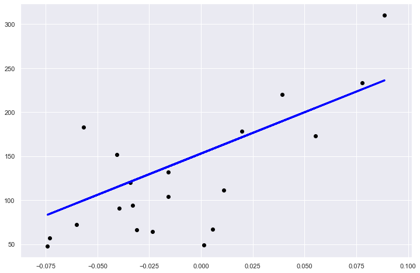

###  Linear models

- A Simple Linear Regression Example ([source](https://github.com/scikit-learn/scikit-learn/tree/master/examples/linear_model))

This example uses the only the first feature of the `diabetes` dataset, in
order to illustrate a two-dimensional plot of this regression technique. The
straight line can be seen in the plot, showing how linear regression attempts
to draw a straight line that will best minimize the residual sum of squares
between the observed responses in the dataset, and the responses predicted by
the linear approximation.

The ```coefficients```, the ```residual sum of squares``` and the ```variance score``` are also
calculated.


```python
import numpy as np
from sklearn import datasets, linear_model
```

- Import  Diabetes Dataset


```python
diabetes = datasets.load_diabetes()

'''Use only one feature'''
diabetes_X = diabetes.data[:, np.newaxis, 2]
```

- Split Dataset to Train and Test


```python
'''Split the data into training/testing sets'''
diabetes_X_train = diabetes_X[:-20]
diabetes_X_test = diabetes_X[-20:]

'''Split the targets into training/testing sets'''
diabetes_y_train = diabetes.target[:-20]
diabetes_y_test = diabetes.target[-20:]
```

- Fit the Model


```python
'''Create linear regression object'''
regr = linear_model.LinearRegression()

'''Train the model using the training sets'''
regr.fit(diabetes_X_train, diabetes_y_train)

```


    LinearRegression(copy_X=True, fit_intercept=True, n_jobs=None, normalize=False)


- Calculate Regression cofficient, Mean Squared Error and Variance score.


```python
'''The coefficients'''
print('Coefficients: \n', regr.coef_)


'''The mean squared error'''
print("Mean squared error: %.2f"
      % np.mean((regr.predict(diabetes_X_test) - diabetes_y_test) ** 2))


'''Explained variance score: 1 is perfect prediction'''
print('Variance score: %.2f' % regr.score(diabetes_X_test, diabetes_y_test))
```

    Coefficients: 
     [938.23786125]
    Mean squared error: 2548.07
    Variance score: 0.47


```python
import matplotlib.pyplot as plt
import seaborn as sns
sns.set()
```


```python
'''Plot outputs'''
plt.figure(figsize = [12,8])

plt.scatter(diabetes_X_test,\
            diabetes_y_test,\
            color='black')

plt.plot(diabetes_X_test,\
         regr.predict(diabetes_X_test),\
         color='blue',
         linewidth=3)

plt.grid(True)
plt.show()
```




