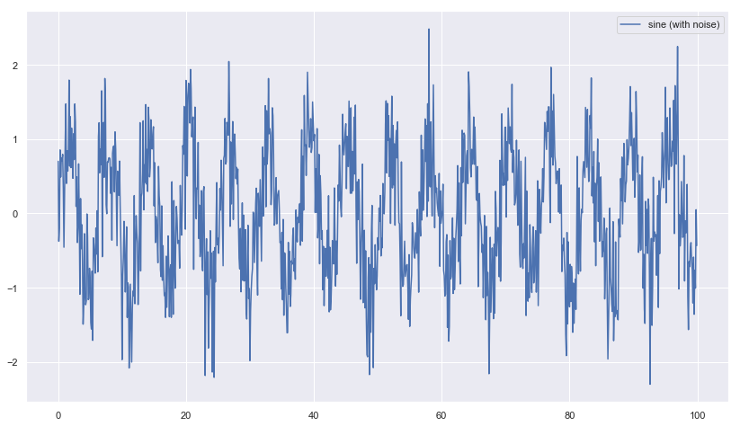
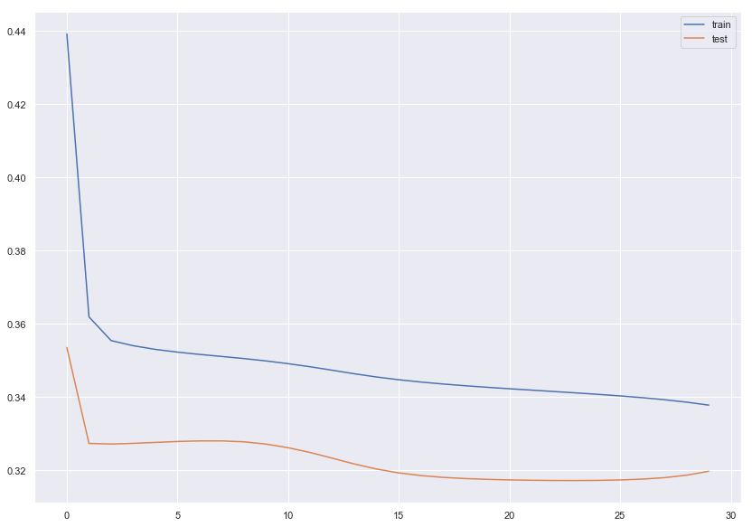
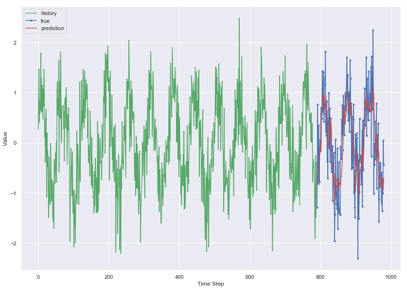
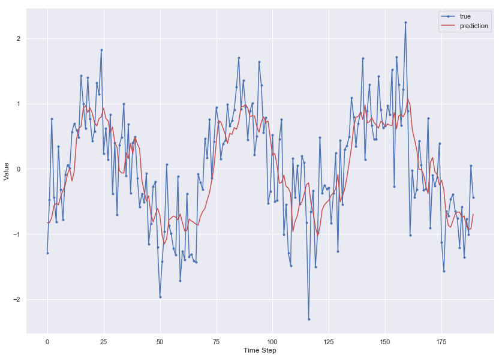

# LSTM-Introduction

For classifying MNIST digits. 

#### Intall Tensorflow


```python
#pip install tensorflow==2.0.0-beta0
#pip install --upgrade tensorflow==2.0.0-beta0
```


```python
import tensorflow as tf
from tensorflow import keras  # tf.keras
import seaborn as sns
import matplotlib as mpl
import matplotlib.pyplot as plt
import numpy as np
import os
import pandas as pd
import sklearn
import sys
import time
```


```python
sns.set()
%matplotlib inline
%load_ext tensorboard
```

    The tensorboard extension is already loaded. To reload it, use:
      %reload_ext tensorboard


```python
print("python", sys.version)
for module in mpl, np, pd, sklearn, tf, keras:
    print(module.__name__, module.__version__)
```

    python 3.7.1 (default, Dec 14 2018, 13:28:58) 
    [Clang 4.0.1 (tags/RELEASE_401/final)]
    matplotlib 3.0.2
    numpy 1.15.4
    pandas 0.23.4
    sklearn 0.20.1
    tensorflow 2.0.0-beta0
    tensorflow.python.keras.api._v2.keras 2.2.4-tf


#### Load data


```python
time = np.arange(0, 100, 0.1)
sin = np.sin(time) + np.random.normal(scale=0.5, size=len(time))
```


```python
plt.figure(figsize = [14,8])
plt.plot(time, sin, label='sine (with noise)');
plt.legend();
```





```python
df = pd.DataFrame(dict(sine=sin), index=time, columns=['sine'])
df.head()
```


<div>
<style scoped>
    .dataframe tbody tr th:only-of-type {
        vertical-align: middle;
    }

    .dataframe tbody tr th {
        vertical-align: top;
    }

    .dataframe thead th {
        text-align: right;
    }
</style>
<table border="1" class="dataframe">
  <thead>
    <tr style="text-align: right;">
      <th></th>
      <th>sine</th>
    </tr>
  </thead>
  <tbody>
    <tr>
      <th>0.0</th>
      <td>0.699236</td>
    </tr>
    <tr>
      <th>0.1</th>
      <td>-0.377399</td>
    </tr>
    <tr>
      <th>0.2</th>
      <td>-0.200619</td>
    </tr>
    <tr>
      <th>0.3</th>
      <td>0.851897</td>
    </tr>
    <tr>
      <th>0.4</th>
      <td>0.487359</td>
    </tr>
  </tbody>
</table>
</div>


```python
train_size = int(len(df) * 0.8)
test_size = len(df) - train_size
train, test = df.iloc[0:train_size], df.iloc[train_size:len(df)]
print(len(train), len(test))
```

    800 200


```python
def create_dataset(X, y, time_steps=1):
    Xs, ys = [], []
    for i in range(len(X) - time_steps):
        v = X.iloc[i:(i + time_steps)].values
        Xs.append(v)
        ys.append(y.iloc[i + time_steps])
    return np.array(Xs), np.array(ys)
```


```python
time_steps = 10

# reshape to [samples, time_steps, n_features]

X_train, y_train = create_dataset(train, train.sine, time_steps)
X_test, y_test = create_dataset(test, test.sine, time_steps)

print(X_train.shape, y_train.shape)
```

    (790, 10, 1) (790,)


### Model


```python
model = keras.models.Sequential([
    
    keras.layers.LSTM(units=128,\
                      input_shape=(X_train.shape[1],X_train.shape[2])),
    
    keras.layers.Dense(units=1)
    
    ])
```


```python
model.compile(
  loss='mean_squared_error',
  optimizer=keras.optimizers.Adam(0.001)
)
```


```python
history = model.fit(
    X_train, y_train,
    epochs=30,
    batch_size=16,
    validation_split=0.1,
    verbose=1,
    shuffle=False
)
```

    Train on 711 samples, validate on 79 samples
    Epoch 1/30
    711/711 [==============================] - 1s 2ms/sample - loss: 0.4392 - val_loss: 0.3535
    Epoch 2/30
    711/711 [==============================] - 0s 478us/sample - loss: 0.3619 - val_loss: 0.3273
    Epoch 3/30
    711/711 [==============================] - 0s 482us/sample - loss: 0.3554 - val_loss: 0.3271
    Epoch 4/30
    711/711 [==============================] - 0s 497us/sample - loss: 0.3540 - val_loss: 0.3273
    Epoch 5/30
    711/711 [==============================] - 0s 462us/sample - loss: 0.3530 - val_loss: 0.3276
    Epoch 6/30
    711/711 [==============================] - 0s 460us/sample - loss: 0.3522 - val_loss: 0.3278
    Epoch 7/30
    711/711 [==============================] - 0s 459us/sample - loss: 0.3516 - val_loss: 0.3280
    Epoch 8/30
    711/711 [==============================] - 0s 474us/sample - loss: 0.3511 - val_loss: 0.3280
    Epoch 9/30
    711/711 [==============================] - 0s 470us/sample - loss: 0.3505 - val_loss: 0.3277
    Epoch 10/30
    711/711 [==============================] - 0s 470us/sample - loss: 0.3498 - val_loss: 0.3271
    Epoch 11/30
    711/711 [==============================] - 0s 481us/sample - loss: 0.3491 - val_loss: 0.3261
    Epoch 12/30
    711/711 [==============================] - 0s 468us/sample - loss: 0.3482 - val_loss: 0.3248
    Epoch 13/30
    711/711 [==============================] - 0s 463us/sample - loss: 0.3473 - val_loss: 0.3233
    Epoch 14/30
    711/711 [==============================] - 0s 452us/sample - loss: 0.3463 - val_loss: 0.3217
    Epoch 15/30
    711/711 [==============================] - 0s 464us/sample - loss: 0.3454 - val_loss: 0.3203
    Epoch 16/30
    711/711 [==============================] - 0s 468us/sample - loss: 0.3447 - val_loss: 0.3192
    Epoch 17/30
    711/711 [==============================] - 0s 473us/sample - loss: 0.3441 - val_loss: 0.3185
    Epoch 18/30
    711/711 [==============================] - 0s 472us/sample - loss: 0.3435 - val_loss: 0.3180
    Epoch 19/30
    711/711 [==============================] - 0s 468us/sample - loss: 0.3431 - val_loss: 0.3177
    Epoch 20/30
    711/711 [==============================] - 0s 478us/sample - loss: 0.3426 - val_loss: 0.3175
    Epoch 21/30
    711/711 [==============================] - 0s 488us/sample - loss: 0.3422 - val_loss: 0.3173
    Epoch 22/30
    711/711 [==============================] - 0s 489us/sample - loss: 0.3419 - val_loss: 0.3172
    Epoch 23/30
    711/711 [==============================] - 0s 483us/sample - loss: 0.3415 - val_loss: 0.3172
    Epoch 24/30
    711/711 [==============================] - 0s 477us/sample - loss: 0.3411 - val_loss: 0.3172
    Epoch 25/30
    711/711 [==============================] - 0s 476us/sample - loss: 0.3407 - val_loss: 0.3172
    Epoch 26/30
    711/711 [==============================] - 0s 470us/sample - loss: 0.3403 - val_loss: 0.3173
    Epoch 27/30
    711/711 [==============================] - 0s 481us/sample - loss: 0.3398 - val_loss: 0.3175
    Epoch 28/30
    711/711 [==============================] - 0s 477us/sample - loss: 0.3392 - val_loss: 0.3179
    Epoch 29/30
    711/711 [==============================] - 0s 488us/sample - loss: 0.3386 - val_loss: 0.3186
    Epoch 30/30
    711/711 [==============================] - 0s 478us/sample - loss: 0.3378 - val_loss: 0.3197


### Evaluation


```python
plt.figure(figsize=[14,10])
plt.plot(history.history['loss'], label='train')
plt.plot(history.history['val_loss'], label='test')
plt.legend();
```





```python
y_pred = model.predict(X_test)
```


```python
plt.figure(figsize=[14,10])
plt.plot(np.arange(0, len(y_train)), y_train, 'g', label="history")
plt.plot(np.arange(len(y_train), len(y_train) + len(y_test)), y_test, marker='.', label="true")
plt.plot(np.arange(len(y_train), len(y_train) + len(y_test)), y_pred, 'r', label="prediction")
plt.ylabel('Value')
plt.xlabel('Time Step')
plt.legend()
plt.show();
```





```python
plt.figure(figsize=[14,10])
plt.plot(y_test, marker='.', label="true")
plt.plot(y_pred, 'r', label="prediction")
plt.ylabel('Value')
plt.xlabel('Time Step')
plt.legend()
plt.show();
```





```python

```
